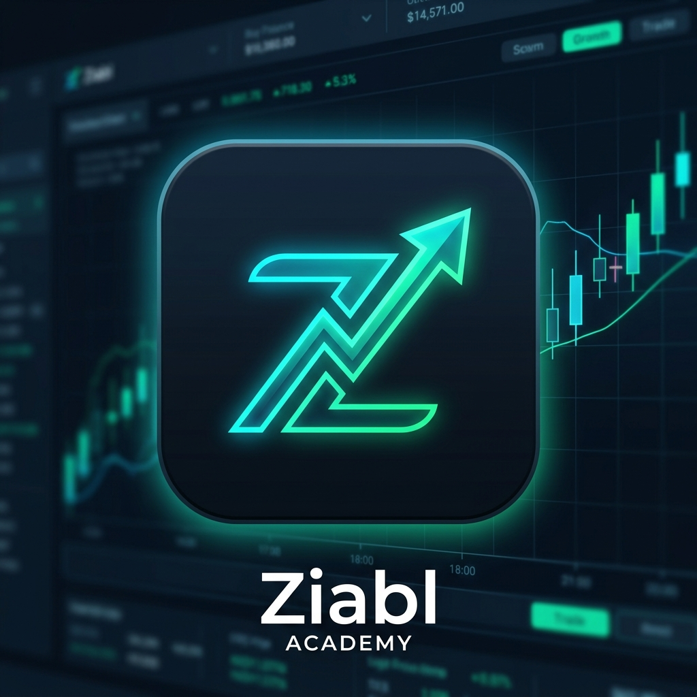
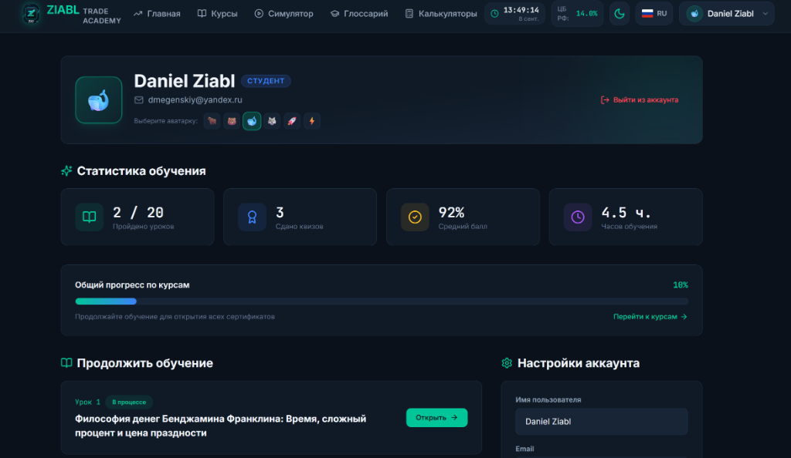
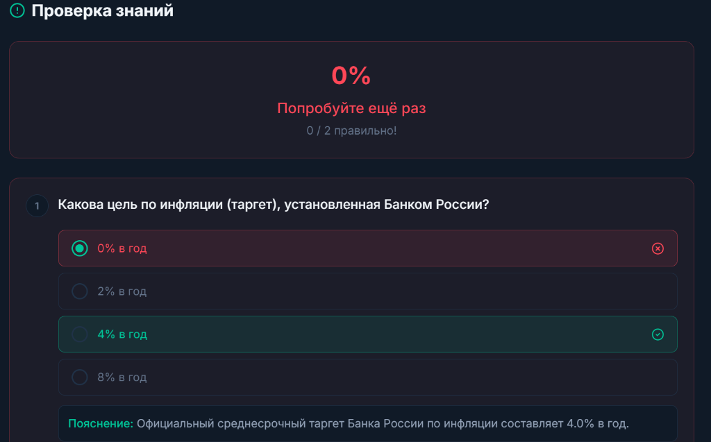

# 🦅 ZIABL Trade Academy
### Интерактивная образовательная экосистема по трейдингу и фундаментальному анализу

*Современная автономная платформа для изучения финансовых рынков: от философских основ Франклина и Кийосаки до сложного процента, фундаментального анализа Баффета и математических стратегий риск-менеджмента.*

[Ключевая функциональность](#-ключевая-функциональность) •
[Методология курсов](#-методология-и-программа) •
[Интерактивный глоссарий](#-интерактивный-глоссарий) •
[Установка и запуск](#-установка-и-запуск) •
[План развития](#-план-развития-roadmap)

---

## ✨ Ключевая функциональность

- 📚 **Глубокие академические модули:** 8 структурированных модулей и 20 объёмных уроков, охватывающих классическую экономическую мысль, механику облигаций (ОФЗ), мультипликаторы акций и макроэкономику.
- 💡 **Интерактивные всплывающие карточки глоссария (Term Modal):** Все ключевые финансовые термины (`EBITDA`, `RUONIA`, `ОФЗ-ПД`, `Net Debt`, `Уравнение Фишера` и др.) кликабельны в тексте уроков. Всплывающее окно позволяет прочесть определение прямо во время урока без потери контекста чтения и прогресса.
- 🧪 **Умное тестирование и автопрохождение:**
  - Тесты с разбором правильных и ошибочных ответов.
  - Автоматическая отметка уроков и модулей пройденными при сдаче теста ($\\ge 70\\%$).
  - Локальное сохранение ответов пользователя — прогресс не сбрасывается при перезапуске приложения.
- 📊 **Торговый симулятор и калькуляторы:**
  - Симулятор биржевых сделок (Buy / Sell) с виртуальным балансом.
  - Калькуляторы реальной процентной ставки (формула Фишера) и сложного процента.
- ⏱️ **Биржевые информеры в реальном времени:**
  - Текущая ключевая ставка ЦБ РФ и график заседаний.
  - Мультизонные часы основных торговых сессий (Москва, Лондон, Нью-Йорк, Токио).
  - Возможность включения и отключения виджетов в настройках профиля.
- 👤 **Локальный профиль и персонализация:**
  - Полная автономность: локальное хранение данных без необходимости регистрации и внешних серверов.
  - Динамическая статистика успеваемости, прогресс-бар и автоподбор следующего урока в блоке «Продолжить обучение».
  - Выбор аватаров, переключение тем (тёмная/светлая) и настройка часового пояса.
- 🌐 **Мультиязычность:** Полная поддержка русского и английского языков (RU / EN).

---

---

## 📸 Интерфейс платформы

  
<b>Личный кабинет инвестора: аналитика прогресса, статистика и виджеты</b>

  
  
  
<b>Интерактивная система тестирования с разбором ответов</b>

  

## 📖 Методология и программа обучения

Курс построен на синтезе практического опыта ведущих мировых финансистов и стандартов Школы Московской Биржи:

| Модуль | Название | Ключевые концепции и авторы |
| :--- | :--- | :--- |
| **01** | **Фундамент финансового мышления** | Бенджамин Франклин («Время — деньги», цена праздности, сложный процент), Роберт Кийосаки (активы vs пассивы, квадрант денежного потока). |
| **02** | **Макроэкономика и процентные ставки** | Ключевая ставка ЦБ РФ, инфляция, уравнение Фишера, реальная ставка, межбанковская ставка RUONIA. |
| **03** | **Рынок облигаций и фиксированный доход** | ОФЗ-ПД, ОФЗ-ИН, ОФЗ-ПК, дюрация Маколея, выпуклость (convexity), кредитные спреды. |
| **04** | **Фундаментальный анализ акций** | Уоррен Баффет & Чарли Мангер (экономические рвы / Moat), мультипликаторы P/E, EV/EBITDA, ROE, FCF, Net Debt. |
| **05** | **Кризисы и уроки истории** | Майкл Бьюрри и кризис subprime-ипотеки 2008 года, кредитные дефолтные свопы (CDS), MBS/CDO, «Чёрный лебедь». |
| **06** | **Психология и поведенческая экономика** | Эвристики Тверски и Канемана, синдром упущенной выгоды (FOMO), тильт, теория перспектив. |
| **07** | **Риск-менеджмент и математика капитала** | Критерий Келли, Value at Risk (VaR), соотношение Risk/Reward, правила контроля просадки. |
| **08** | **Дивидендные стратегии и пассивный доход** | Дивидендные аристократы, эффект реинвестирования (DRIP), налоговое планирование (ИИС типа А и Б). |

---

## 🗂️ Интерактивный глоссарий

В платформу интегрирован академический справочник из **60+ финансовых терминов**, разбитых по категориям:
- **Макроэкономика:** *Ключевая ставка, Таргетирование инфляции, Уравнение Фишера, RUONIA...*
- **Облигации:** *Купонный доход, Дюрация, ОФЗ-ПД, Кредитный спред, Доходность к погашению (YTM)...*
- **Акции и метрики:** *EBITDA, Net Debt, Free Cash Flow (FCF), P/E, EV/EBITDA, ROE, Экономический ров...*
- **Деривативы и кризисы:** *CDS, CDO, MBS, Шорт-сквиз, Субстандартная ипотека...*
- **Риск-менеджмент:** *Критерий Келли, VaR, Максимальная просадка (Drawdown), Коэффициент Шарпа...*

---

## 📥 Установка и запуск

Приложение распространяется в автономном виде (Offline-First) и не требует подключения к внешним базам данных:

### 🖥️ Windows (.exe)
1. Перейдите в раздел **[Releases](https://github.com/DanielCarti/ziabl-trading-academy/releases)** репозитория.
2. Скачайте последнюю версию инсталлятора `ZIABL-Trade-Academy-Setup.exe`.
3. Запустите установку и начните обучение — весь прогресс сохраняется локально на вашем компьютере.

### 📱 Android (.apk)
1. Скачайте установочный пакет `ZIABL-Trade-Academy.apk` со страницы **[Releases](https://github.com/DanielCarti/ziabl-trading-academy/releases)**.
2. Установите приложение на мобильное устройство (разрешив установку из надёжного источника).
3. Приложение работает автономно без подключения к интернету.

---

## 📦 План развития (Roadmap)

- [x] Расширенная учебная программа по методикам Баффета, Франклина и Школы Мосбиржи.
- [x] Всплывающие модальные карточки для всех ключевых финансовых терминов.
- [x] Автоматическое сохранение ответов на тесты и прогресса обучения.
- [x] Кастомизация виджетов ЦБ РФ и биржевых часов.
- [x] Автономный режим с локальным профилем без обязательной онлайн-регистрации.
- [ ] Готовые сборки под macOS (.dmg) и Linux (.AppImage).
- [ ] Экспорт конспектов и персональных заметок по урокам в PDF.

---

## 📄 Лицензия

Проект распространяется под лицензией [MIT](LICENSE).

Разработано с ❤️ для начинающих и практикующих инвесторов.

